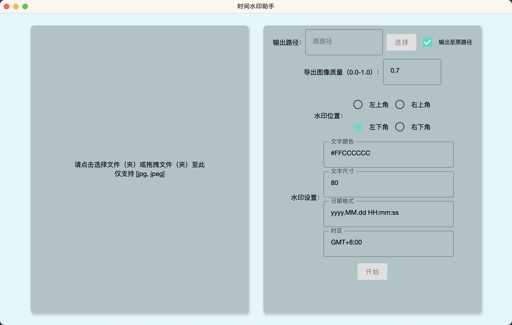
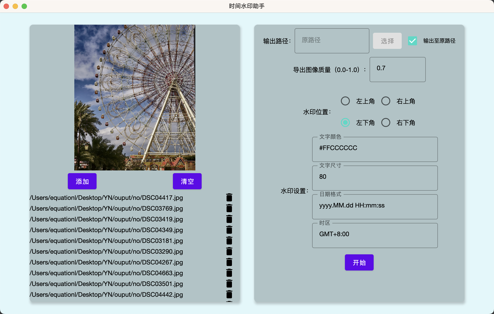
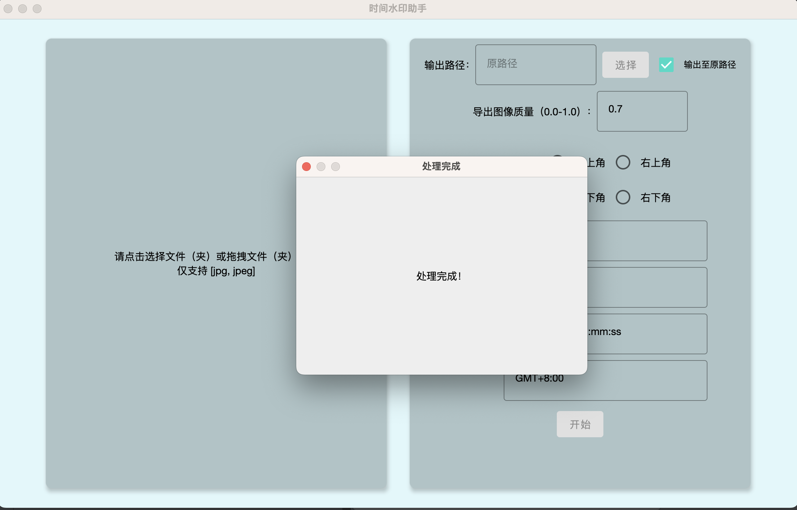
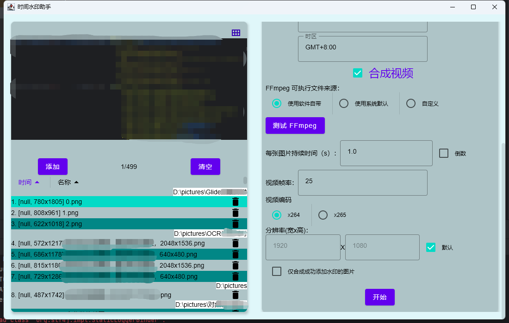

# 简介
这是一款使用 Compose 实现的快速为照片添加时间水印的桌面端应用。

使用 Compose-multiplatform （原 Compose-jb）实现，所以支持所有桌面端（Windows、macOS、Linux）。

适合用于为制作延时视频而拍摄的照片添加时间信息并一键合成视频。

通过读取照片 EXif 中的拍摄时间信息来为您的照片添加时间水印。

支持自定义水印文字格式、自定义水印位置、自定义文字大小、自定义文字颜色等。

支持一键拖拽文件夹或文件批量添加。

支持直接使用图片生成视频；支持自定义视频帧率、图片持续时间、视频分辨率等。

# 截图








# 使用方法

## 一、自行编译运行

下载源码后使用 IDEA 打开项目。

首次编译会自动下载所需依赖库。

如只需要直接运行，则运行 task `run` 即可：

```shell
./gradlew run
```

如需打包成安装包后安装使用，请运行 `packageReleaseDistributionForCurrentOS` task：

```shell
./gradlew packageReleaseDistributionForCurrentOS 
```

## 二、下载已编译安装包直接使用
我在 [releases](https://github.com/equationl/TimelapseHelper/releases) 页面提供了已编译完成的安装包，直接下载安装即可使用。

由于不支持交叉编译，所以目前只提供了我有的设备类型的安装包，即 Windows X64 和 macOs ARM 。

# 实现思路和技术细节
1. [Compose For Desktop 实践：使用 Compose-jb 做一个时间水印助手](https://juejin.cn/post/7165387863129849864)
2. [为 Compose 的 TextField 添加类似 EditText inputType 的输入过滤](https://juejin.cn/post/7214314627521282085)
3. [Compose Desktop 使用中的几个问题（分平台加载资源、编写Gradle 任务下载平台资源、桌面特有组件、鼠标&键盘事件）](https://juejin.cn/post/7269014861380354105)

# 参考资料
1. [使用ComposeDesktop开发一款桌面端多功能APK工具](https://juejin.cn/post/7122645579439538183)
2. [From Swing to Jetpack Compose Desktop #2](https://dev.to/tkuenneth/from-swing-to-jetpack-compose-desktop-2-4a4h)
3. [Java中图片添加水印（文字+图片水印）](https://juejin.cn/post/6982192057209077791)
4. [metadata-extractor](https://github.com/drewnoakes/metadata-extractor)
5. [Image and in-app icons manipulations](https://github.com/JetBrains/compose-jb/tree/master/tutorials/Image_And_Icons_Manipulations)